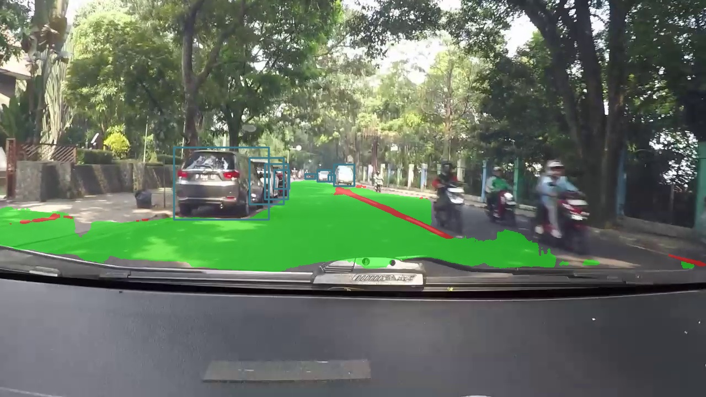
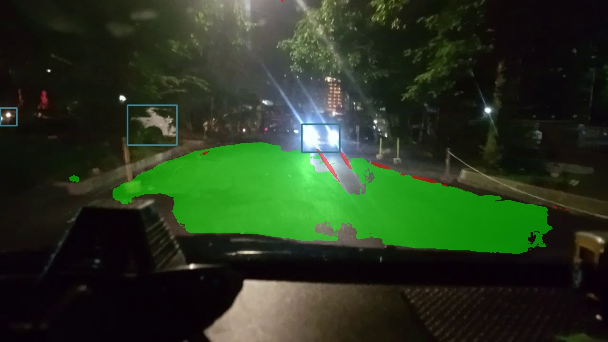

# 🚗 YOLOP-GhostNet: Joint Perception for Autonomous Driving

This repository presents an improved multi-task perception model based on YOLOP for autonomous vehicle scene understanding.

---

## 📄 Conference Paper

**Implementation of Joint Segmentation Semantic Understanding Method to Develop Autonomous Vehicle Driving Perception**

📍 2025 9th International Conference on Instrumentation, Control, and Automation (ICA)  
📅 August 2025  
🔗 DOI: 10.1109/ICA65945.2025.11252505  

---

## ⚙️ Installation


git clone https://github.com/mestakindo/YOLOP-Ghostnet-Thesis.git

cd YOLOP-Ghostnet-Thesis

pip install -r requirements.txt

---

## ⭐ Key Contributions

- Integration of **GhostNet backbone** for lightweight feature extraction  
- Replacement of activation function with **SiLU activation**  
- Implementation of **SIoU Loss** for improved bounding box regression  
- Optimization of joint multi-task learning configuration for:

  - Object Detection  
  - Drivable Area Segmentation  
  - Lane Line Segmentation  

---

## 🧠 Model Overview

```
Input Image
   ↓
GhostNet Backbone
   ↓
Shared Feature Representation
   ↓
 ┌──────────────┬──────────────┬──────────────┐
 │ Detection    │ Drivable Area│ Lane Line    │
 │ Head         │ Segmentation │ Segmentation │
 └──────────────┴──────────────┴──────────────┘
```

---

## 📈 Experimental Results

### 🚗 Object Detection Performance

| Model | Precision | Recall | mAP@0.5 |
|------|-----------|--------|---------|
| YOLOP | 0.110 | 0.88 | 0.44 |
| YOLOP-GhostNet (Ours) | 0.093 | 0.71 | **0.60** |

---

### 🛣 Lane Line Segmentation Performance

| Model | Accuracy | IoU | mIoU |
|------|----------|-----|------|
| YOLOP | 0.699 | 0.266 | 0.625 |
| YOLOP-GhostNet (Ours) | 0.699 | **0.305** | **0.642** |

---

### 🟩 Drivable Area Segmentation Performance

| Model | Accuracy | IoU | mIoU |
|------|----------|-----|------|
| YOLOP | 0.974 | **0.859** | **0.914** |
| YOLOP-GhostNet (Ours) | 0.971 | 0.849 | 0.907 |

---

### ⚡ Inference Speed

| Model | Inference Time | NMS Time |
|------|----------------|----------|
| YOLOP | 0.0030 s/frame | 0.0007 s/frame |
| YOLOP-GhostNet (Ours) | **0.0017 s/frame** | 0.0009 s/frame |

---

## ⚙️ Model Complexity Analysis

| Model | Parameters (Million) | Reduction |
|------|----------------------|-----------|
| Original YOLOP (Paper) | 48.0 | — |
| YOLOP Baseline (Reproduced) | 7.96 | 83.4% ↓ vs Paper |
| YOLOP-GhostNet (Ours) | **7.94** | **0.26% ↓ vs Baseline** |


## 🎯 Qualitative Results

### Daytime Driving Scene



---

### Night Driving Scene




## 🚀 Training

To train the model using default configuration:

python tools/train.py --cfg lib/config/default.py

You may modify configuration parameters depending on dataset path, batch size, or training strategy.

---
### 🔬 Training Setup

Two training configurations were evaluated:

- **YOLOP(A)**: Baseline model using CSPDarknet-Tiny backbone across the shared feature extraction pipeline.
- **YOLOP(B)**: Proposed model replacing segmentation branch backbone with **GhostNet**, while keeping other components identical to isolate backbone impact.

---

### 🧠 Implementation Details

- Python Version: ≥ 3.9  
- Framework: PyTorch 2.4.1 + TorchVision  
- GPU: NVIDIA GeForce RTX 4080  
- Configuration Management: YAML-based experiment settings  
- Reproducibility: fixed random seed, version locking, checkpoint saving per experiment  

---

### 📂 Dataset Preparation

- Dataset: BDD100K  
- Split Ratio: **Train / Val / Test = 70 / 20 / 10**
- Detection annotations converted from **COCO JSON → YOLO TXT format**
- Segmentation masks generated as **PNG maps** for:
  - Drivable Area  
  - Lane Line  

---

### 🖼 Image Preprocessing & Augmentation

- Pixel Normalization applied  
- Training augmentations:
  - Horizontal Flip  
  - Brightness / Contrast adjustment  
  - Blur  
  - Perspective Transform  
- Optional detection enrichments:
  - Mosaic  
  - MixUp  

---

### ⚙️ DataLoader Configuration
- Batch size adjusted according to GPU VRAM capacity  
- Pin memory and worker settings tuned for training stability  
---

### 🧪 Training Hyperparameters 

- Epochs: **240**
- Batch Size per GPU: **16**
- Optimizer: **Adam**
- Initial Learning Rate (LR0): **0.001**
- Final LR Factor (LRF): **0.2**
- Momentum: **0.937**
- Weight Decay: **0.0005**
- Warmup Epochs: **3**
- Anchor Threshold: **4.0**
- Validation Frequency: **Every Epoch**
---

### 🧩 Loss Function Design

Bounding box regression loss was modified by replacing the default IoU-based loss with **SIoU Loss** in the detection head.

This modification aims to improve localization stability and convergence behaviour during multi-task joint optimization.
---

### ⚙️ Input & Augmentation Settings

- Training Resolution: **320 × 192**
- Original Image Size: **1280 × 720**
- Horizontal Flip: Enabled  
- HSV Augmentation: H=0.015 / S=0.7 / V=0.4  
- Translation: 0.1  
- Scale: 0.25  
- Rotation: 10°  


## 🧪 Evaluation

To evaluate trained model:

python tools/test.py
📊 Experimental Environment
GPU: NVIDIA RTX 4080
Framework: PyTorch
Dataset: BDD100K
Training Strategy: Multi-task joint optimization

---

## 🔎 Key Findings

- GhostNet integration significantly improves **mAP@0.5 (+36%)** compared to reproduced YOLOP baseline.
- Lane segmentation quality improves with **higher IoU and mIoU**, indicating better boundary learning.
- Drivable area segmentation remains stable with only minor performance degradation.
- Inference speed improves by **43%**, demonstrating suitability for real-time deployment.
- Parameter reduction confirms the lightweight design objective.

Overall, the proposed YOLOP-GhostNet achieves better perception efficiency while maintaining competitive multi-task performance.

---

## 🙏 Acknowledgement

This repository is based on the original YOLOP implementation:

https://github.com/hustvl/YOLOP

We sincerely thank the original authors for their contribution.

---

## 📚 Citation

If you use this repository, please cite:

@inproceedings{mestakindo2025joint,
  title={Implementation of Joint Segmentation Semantic Understanding Method to Develop Autonomous Vehicle Driving Perception},
  author={Mestakindo, Fauzand},
  booktitle={International Conference on Instrumentation, Control, and Automation},
  year={2025}
}

## 📜 License

This project follows the MIT License inherited from the original YOLOP repository.
